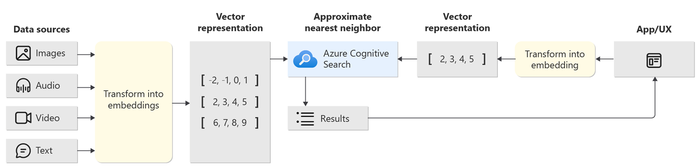
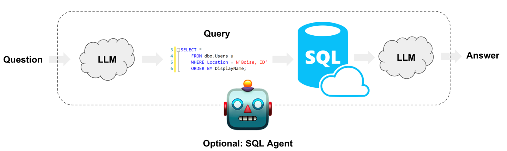

[](https://github.com/dev-jpnobrega/ai-agent/actions/workflows/npm-publish.yml)

# AI Agent

AI Agent simplifies the implementation and use of generative AI with LangChain, you can add components such as vectorized search services (check options in "link"), conversation history (check options in "link"), custom databases (check options in "link") and API contracts ([OpenAPI](https://swagger.io/blog/api-design/openapi-driven-api-design/)).

# Installation

Use the package manager [npm](https://www.npmjs.com/) to install AI Agent.

```bash
npm install ai-agent
```

## Simple use

LLM + Prompt Engineering

```javascript
const agent = new Agent({
  name: '<name>',
  systemMesssage: '<a message that will specialize your agent>',
  llmConfig: {
    type: '<cloud-provider-llm-service>', // Check availability at <link>
    model: '<llm-model>',
    instance: '<instance-name>', // Optional
    apiKey: '<key-your-llm-service>', // Optional
  },
  chatConfig: {
    temperature: 0,
  },
});

// If stream enabled, receiver on token
agent.on('onToken', async (token) => {
  console.warn('token:', token);
});

agent.on('onMessage', async (message) => {
  console.warn('MESSAGE:', message);
});

await agent.call({
  question: 'What is the best way to get started with Azure?',
  chatThreadID: '<chat-id>',
  stream: true,
});
```

## Using with Chat History

When you use LLM + Chat history all message exchange is persisted and sent to LLM.

```javascript
  const agent = new Agent({
    name: '<name>',
    systemMesssage: '<a message that will specialize your agent>',
    chatConfig: {
      temperature: 0,
    },
    llmConfig: {
      type: '<cloud-provider-llm-service>', // Check availability at <link>
      model: '<llm-model>',
      instance: '<instance-name>', // Optional
      apiKey: '<key-your-llm-service>', // Optional
    },
    dbHistoryConfig: {
      type: '<type-database>', // Check availability at <link>
      host: '<host-database>', // Optional
      port: "<port-database>", // Optional
      sessionTTL: '<ttl-database>' // Optional. Time the conversation will be saved in the database
      limit: '<limit-messages>' // Optional. Limit set for maximum messages included in conversation prompt
    },
  });

  // If stream enabled, receiver on token
  agent.on('onToken', async (token) => {
    console.warn('token:', token);
  });

  agent.on('onMessage', async (message) => {
    console.warn('MESSAGE:', message);
  });

  await agent.call({
    question: 'What is the best way to get started with Azure?',
    chatThreadID: '<chat-id>',
    stream: true,
  });
```

## Using with Vector stores

When using LLM + Vector stores the Agent finds the documents relevant to the requested input.
The documents found are used for the context of the Agent.

### Example of the concept of vectorized search


<br/><br/>

```javascript
  const agent = new Agent({
    name: '<name>',
    systemMesssage: '<a message that will specialize your agent>',
    chatConfig: {
      temperature: 0,
    },
    llmConfig: {
      type: '<cloud-provider-llm-service>', // Check availability at <link>
      model: '<llm-model>',
      instance: '<instance-name>', // Optional
      apiKey: '<key-your-llm-service>', // Optional
    },
    vectorStoreConfig: {
      type: '<cloud-provider-llm-service>', // Check availability at <link>
      apiKey: '<your-api-key>', // Optional
      indexes: ['<index-name>'], // Your indexes name. Optional
      vectorFieldName: '<vector-base-field>', // Optional
      name: '<vector-service-name>', // Optional
      apiVersion: "<api-version>", // Optional
      model: '<llm-model>' // Optional
      customFilters: '<custom-filter>' // Optional. Example: 'field-vector-store=(userSessionId)' check at <link>
    },
  });

  // If stream enabled, receiver on token
  agent.on('onToken', async (token) => {
    console.warn('token:', token);
  });

  agent.on('onMessage', async (message) => {
    console.warn('MESSAGE:', message);
  });

  await agent.call({
    question: 'What is the best way to get started with Azure?',
    chatThreadID: '<chat-id>',
    stream: true,
  });
```

## Using with Database custom

SQL + LLM for prompt construction is a concept that involves using both Structured Query Language (SQL) and LLMs to create queries or prompts for data retrieval or interaction with databases. This approach leverages the power of SQL for database-specific commands and the capabilities of LLMs to generate natural language prompts, making it easier for users to interact with databases and retrieve information in a more user-friendly and intuitive manner.

### Example of the concept of SQL + LLM

<br/><br/>

```javascript
  const agent = new Agent({
    name: '<name>',
    systemMesssage: '<a message that will specialize your agent>',
    chatConfig: {
      temperature: 0,
    },
    llmConfig: {
      type: '<cloud-provider-llm-service>', // Check availability at <link>
      model: '<llm-model>',
      instance: '<instance-name>', // Optional
      apiKey: '<key-your-llm-service>', // Optional
    },
    vectorStoreConfig: {
      type: '<cloud-provider-llm-service>', // Check availability at <link>
      apiKey: '<your-api-key>', // Optional
      indexes: ['<index-name>'], // Your indexes name. Optional
      vectorFieldName: '<vector-base-field>', // Optional
      name: '<vector-service-name>', // Optional
      apiVersion: "<api-version>", // Optional
      model: '<llm-model>' // Optional
      customFilters: '<custom-filter>' // Optional. Example: 'field-vector-store=(userSessionId)' check at <link>
    },
  });

  // If stream enabled, receiver on token
  agent.on('onToken', async (token) => {
    console.warn('token:', token);
  });

  agent.on('onMessage', async (message) => {
    console.warn('MESSAGE:', message);
  });

  await agent.call({
    question: 'What is the best way to get started with Azure?',
    chatThreadID: '<chat-id>',
    stream: true,
  });
```


## Contributing

If you've ever wanted to contribute to open source, and a great cause, now is your chance!

See the [contributing docs](CONTRIBUTING.md) for more information

## Contributors ✨

<!-- ALL-CONTRIBUTORS-LIST:START - Do not remove or modify this section -->
<!-- prettier-ignore-start -->
<!-- markdownlint-disable -->

<table>
  <tr>
    <td align="center"><a href="https://github.com/dev-jpnobrega"><br /><sub><b>JP. Nobrega</b></sub></a><br /><a href="https://github.com/dev-jpnobrega/api-rest/issues" title="Answering Questions">💬</a> <a href="https://github.com/dev-jpnobrega/api-rest/master#how-do-i-use" title="Documentation">📖</a> <a href="https://github.com/dev-jpnobrega/api-rest/pulls" title="Reviewed Pull Requests">👀</a> <a href="#talk-kentcdodds" title="Talks">📢</a></td>
  </tr>
</table>

<!-- markdownlint-enable -->
<!-- prettier-ignore-end -->

<!-- ALL-CONTRIBUTORS-LIST:END -->

## License

[Apache-2.0](LICENSE)
